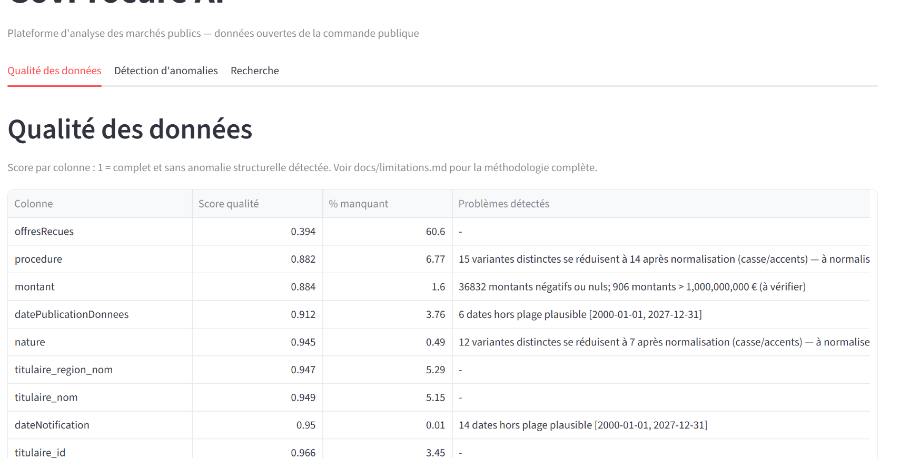
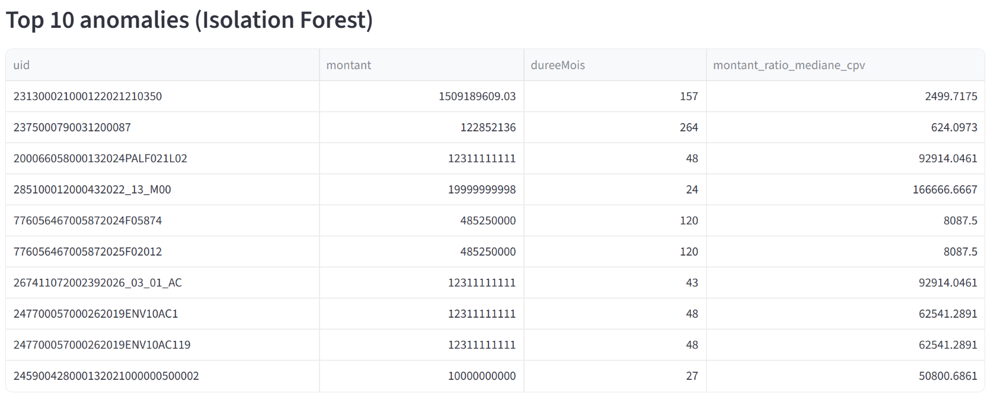
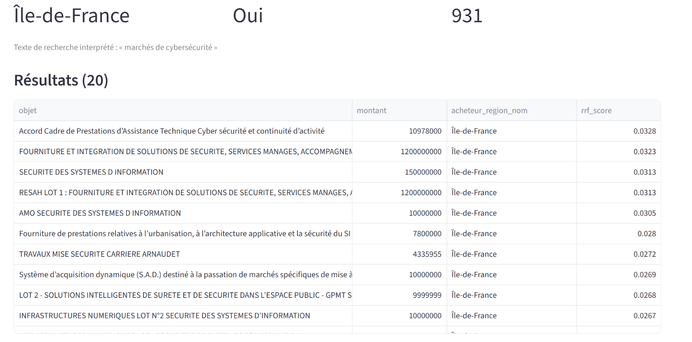

# GovProcure AI

[](https://github.com/sumarc183-design/govprocure-ai/actions/workflows/tests.yml)

> Plateforme d'analyse des marchés publics français : contrôle de qualité des données, détection d'anomalies, recherche hybride en langage naturel et prédiction du nombre d'offres reçues.

**Statut : v1.0 — périmètre fonctionnel finalisé.** Le projet est conçu comme une démonstration technique reproductible et documentée, et non comme un outil de décision automatisée en production. Consultez le [statut de livraison](docs/project_status.md) pour le périmètre exact et les validations réalisées.

## Pourquoi ce projet

GovProcure AI applique des méthodes de data science et de recherche d'information à **3,14 millions** de lignes de données ouvertes sur la commande publique. L'objectif est de rendre ces données plus faciles à explorer, tout en explicitant les limites méthodologiques : une anomalie statistique n'est jamais assimilée à une fraude et les résultats restent destinés à l'examen humain.

| Domaine | Résultat livré |
|---|---|
| Données | 3,14 M de lignes ; ~1,73 M marchés après regroupement des cotraitants |
| Qualité | Score de fiabilité par colonne et détection de 64 408 montants incohérents |
| Anomalies | Isolation Forest et LOF, avec comparaison de stabilité et traçabilité des alertes |
| Recherche | Filtres, BM25, embeddings et RRF ; cache disque mesuré 47× plus rapide sur une requête répétée |
| Prédiction | Random Forest sur `offresRecues` : R² = 0,676 ; MAE = 5,45 offres |
| Qualité logicielle | Tests, lint, vérification de types, audit des dépendances et CI GitHub Actions |

## Aperçu

| Qualité des données | Détection d'anomalies | Recherche hybride |
|---|---|---|
|  |  |  |

## Fonctionnalités

1. **Audit et qualité des données** — scores de complétude et règles explicites pour les montants, dates et catégories.
2. **Détection d'anomalies** — deux méthodes complémentaires, exécutées sur des marchés dédupliqués avant analyse.
3. **Recherche hybride** — filtres métier, recherche lexicale BM25, recherche sémantique par embeddings et fusion par Reciprocal Rank Fusion.
4. **Dashboard Streamlit** — interface à trois onglets avec export CSV des résultats.
5. **Prédiction supervisée** — comparaison d'une baseline, Ridge et Random Forest pour `offresRecues`.

## Démarrage rapide

### Prérequis

- Python 3.11 ou supérieur
- ~250 Mo disponibles pour le jeu de données Parquet

### Installation

```bash
python -m venv .venv
# Windows
.venv\Scripts\activate
# macOS / Linux
source .venv/bin/activate

pip install -r requirements.txt
```

### Données

Le dataset n'est pas versionné afin de respecter la taille du dépôt. Téléchargez le fichier Parquet depuis [data.gouv.fr](https://www.data.gouv.fr/api/1/datasets/r/11cea8e8-df3e-4ed1-932b-781e2635e432), renommez-le `decp.parquet`, puis placez-le ici :

```text
data/raw/decp.parquet
```

La source est mise à jour fréquemment : les chiffres documentés correspondent donc à la version auditée et peuvent varier légèrement après un nouveau téléchargement. Les détails figurent dans les [sources de données](docs/data_sources.md).

### Lancer l'application

```bash
streamlit run src/dashboard/app.py
```

## Vérification et qualité

```bash
# Suite unitaire et intégration sans navigateur
pytest tests/ -v

# Qualité de code
ruff check src/ tests/
mypy --ignore-missing-imports src/
```

Les cinq tests fonctionnels du dashboard requièrent le dataset local et Playwright :

```bash
pip install -r requirements-dev.txt
playwright install chromium
pytest tests/test_dashboard_functional.py -v
```

La CI exécute la suite compatible sans dataset local, le lint, le contrôle de types et un audit des dépendances (`pip-audit`) à chaque push et pull request.

## Architecture

```text
src/
├── common/       # normalisation de texte partagée
├── quality/      # audit, chargement et nettoyage
├── anomaly/      # features, Isolation Forest, LOF, robustesse
├── search/       # filtres, BM25, embeddings, RRF et évaluation
├── dashboard/    # interface Streamlit
└── prediction/   # features, entraînement et évaluation
```

## Documentation

- [Statut de livraison](docs/project_status.md) — périmètre livré, validation et conditions de fonctionnement.
- [Synthèse finale](docs/synthese_finale.md) — résultats, limites et recommandations de production.
- [Roadmap](docs/roadmap.md) — réalisé en v1.0 et axes post-v1.0 priorisés.
- [Décisions techniques](docs/decisions.md) — choix d'architecture et corrections de bugs documentées.
- [Limites et résultats détaillés](docs/limitations.md) — robustesse, biais et limites connues.
- [Sources de données](docs/data_sources.md) — provenance, granularité et audit du jeu de données.
- [Changelog](CHANGELOG.md) — historique des versions et de la maintenance.

## Périmètre et limites

- Les anomalies servent à **prioriser une revue humaine** ; elles ne constituent pas une détection de fraude.
- Le modèle de prédiction est soumis à un biais de sélection, car `offresRecues` est incomplet.
- Le premier calcul d'embeddings sur un sous-ensemble non mis en cache reste coûteux sur CPU.
- Le projet ne fournit pas d'API, d'authentification, de SLA ni d'infrastructure de production.

Ces limites ne sont pas cachées : elles sont détaillées dans la [synthèse finale](docs/synthese_finale.md) et dans les [limites](docs/limitations.md).

## Licence

Projet personnel réalisé dans le cadre d'une candidature. Tous droits réservés — aucune licence open source n'est accordée à ce stade. Les données DECP utilisées sont disponibles sous [Licence Ouverte / Open Licence 2.0](https://www.etalab.gouv.fr/licence-ouverte-open-licence).
